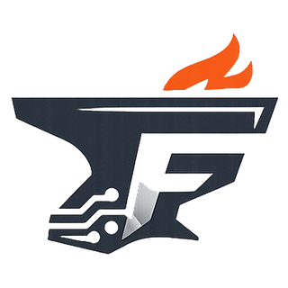
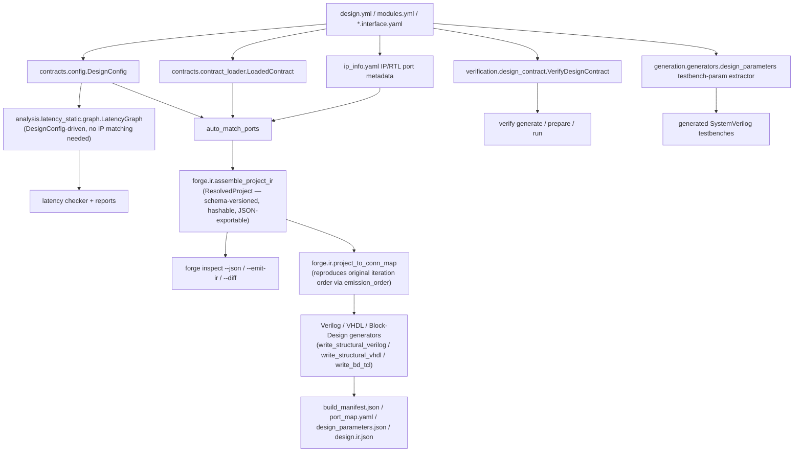

<p align="center">
  
</p>

# FORGE

Framework for Orchestrated RTL Generation & Evaluation.

> An algorithm-agnostic, contract-driven integration and verification
> framework for RTL and HLS firmware targeting **AMD/Xilinx** FPGA
> toolchains.

FORGE is a plugin-agnostic framework for contract-driven DUT generation,
optional HLS orchestration, and reusable verification runtime flows.
It originated as trigger/DAQ firmware tooling built at CERN for the
CMS/OMTF collaboration, and is released as a general-purpose,
detector-agnostic open-source project (MIT-licensed) — CMS/OMTF remains
a user of the framework, not its scope. See `CONTRIBUTING.md` for the
provenance note and current distribution story (git-install-only, no
PyPI publish — a closed decision, not a placeholder pending one).

Repository:

- Canonical public host: [`https://github.com/pleguina/forge`](https://github.com/pleguina/forge).
  The project originated on a CERN GitLab instance
  (`gitlab.cern.ch/p2u-omtf-ops/arc-framework`); that origin is retained
  for its history but is no longer the primary source.

## Current scope

FORGE's public identity for this release is deliberately narrower than
"universal FPGA/ASIC framework." What's actually implemented and tested:

| Axis | Current support |
|---|---|
| Toolchains | Vivado (structural Verilog/VHDL, Block Design TCL), Vitis HLS, XSim |
| Simulation backends | `xsim`, `csim`; Verilator is available as a lint tool only, not a simulation backend |
| Verification datasets | XML-backed only (`design.verification.yml` + XML golden data) |
| Clock/reset domains | A single functional clock/reset domain per module — `clock_secondary`/`reset_secondary` roles exist in the schema but are explicitly **reserved** and have no functional effect (see `docs/IP_INTERFACE_POLICY.md` "Reserved roles"). Real, structural cross-module CDC crossing detection and synchronizer generation *do* exist (`forge.contracts.cdc.verify_cdc`), gated behind `gen-top --strict` |
| Topology matching | Contract-driven wiring, scatter/gather, N-D template and prefix-array bindings, structured `coordinates:`/legacy `partition:` matching (see `docs/IP_INTERFACE_POLICY.md`) |
| Vendors/toolchains **not** supported | Intel/Altera, Lattice, generic ASIC flows, GHDL or cocotb/VUnit as a primary simulation path |

## Architecture (canonical IR — generation is IR-driven for all three modes)

A canonical resolved-design IR (`forge/ir/` — `ResolvedProject`/
`ResolvedDesign`/etc., see `forge inspect` below) covers topology/config
loading, interface-contract loading, and IP/RTL port metadata.
`topgen gen-top` — `--mode verilog`, `vhdl`, and `bd` alike — is genuinely
**driven by** the IR: it builds the IR from its matching/config
computation, then each generator
(`write_structural_verilog`/`write_structural_vhdl`/`write_bd_tcl`) is fed
the connection topology projected back out of the IR
(`forge.ir.project.project_to_conn_map`) rather than the raw matcher output
directly — proven byte-identical to the original on both reference
designs. `design.ir.json` is emitted from that same IR object alongside
the existing manifests for verilog/vhdl/bd, and also carries the resolved
top-level port list (`design.top_ports`) for verilog mode, sourced from
the generator's own structured `report["top_ports"]` rather than a
regex re-parse of the generated file. `forge analyze latency-check`'s
`LatencyGraph` also does not independently re-parse
`design.yml`/`modules.yml` — it builds from `DesignConfig`/`Module` (the
same shared loader the IR itself uses), including the module registry's
optional `latency_cycles`/`latency_hint`/`variable_latency` metadata
(`Module.timing`, see `docs/IP_INTERFACE_POLICY.md`), while deliberately
stopping short of the full matched IR so latency analysis keeps working
before any IP is built. The IR is **not yet** consumed by
`generate_build_manifest` (needs resolved build-artifact paths the IR
doesn't model yet), visualization, or verification planning — those still
independently re-derive overlapping facts from the same
`design.yml`/`modules.yml`/interface-contract YAML sources, exactly as
shown below.



Try it:

```bash
forge inspect plugins/passthrough_demo/forge/designs/design.yml \
    --contracts-from plugins/passthrough_demo/forge/modules.yml

# JSON, a written IR snapshot, and content-hash provenance:
forge inspect design.yml --contracts-from modules.yml --json
forge inspect design.yml --contracts-from modules.yml --emit-ir build/forge/design.ir.json
forge inspect design.yml --contracts-from modules.yml --provenance build/forge/provenance.json
forge inspect design.yml --contracts-from modules.yml --explain-staleness build/forge/provenance.json
```

Each `ResolvedConnection` in the IR carries a `wiring_method`
(`contract_wiring`/`topology_group`/`port_map`/`auto_match`/`heuristic`) —
the first slice of matching evidence (release-plan §3.5).

### Package layout

`forge/` is organized by capability, not by history — `forge.contracts`,
`forge.generation`, `forge.verification`, `forge.analysis`,
`forge.integration`, alongside `forge.core`, `forge.ir`, `forge.hls`, and
`forge.docsgen`. There is no old-name compatibility layer: FORGE has no
public release yet and no external consumers depend on any prior package
name, so each rename (`framework`→`integration`, `verify`→`verification`,
`analyze`→`analysis`, `topgen`→`contracts`+`generation`) was done as a
clean, breaking move with the old path deleted outright rather than
aliased. See
[ADR 0005](docs/development/adr/0005-package-and-cli-naming.md) for the
full rationale and package-ownership boundaries.

## Versioning

Two independent version numbers appear in this repo — they track different
things and are not expected to match:

- **Package version** (`forge/pyproject.toml`, currently `2.0.0`) — the
  installed `forge` Python package/CLI release. Follows semver; see
  `CONTRIBUTING.md` for what counts as a MAJOR/MINOR/PATCH change here.
  `2.0.0` is the ARC → FORGE rename — a breaking, shim-free change to the
  CLI/package/directory surface. See `MIGRATION.md`.
- **Verification contract version** (currently `v1.0`, referenced throughout
  `docs/`) — the version of the Layer 1 verification model itself
  (`design.verification.yml` schema, generated artifact set, CLI contract
  behavior). It changes far less often than the package version, and did
  not change in `2.0.0`.

## Documentation

The full documentation is an [MkDocs Material](https://squidfunk.github.io/mkdocs-material/)
site under [`docs/`](docs/) (build it locally with `pip install -e "forge[docs]"` then
`mkdocs serve`). Start here:

- **[Quickstart](docs/getting-started/quickstart.md)** — five minutes from
  install to a working DUT, using the exact commands CI runs to prove a
  fresh install works.
- **[Vision Pipeline tutorial](docs/tutorials/vision-pipeline/index.md)** —
  a progressive, 12-chapter, fully worked reference project (mixed HLS/RTL,
  parallel paths, CDC, throughput/backpressure, datasets and golden
  models, platform integration, diagnostics), every command actually run
  while writing it, real captioned figures generated from the real
  design/dataset, not invented.
- **[Golden-Path Tutorial](docs/tutorials/golden-path.md)**,
  **[RTL Example](docs/tutorials/rtl-example.md)**, and
  **[Mixed HLS/RTL Example](docs/tutorials/mixed-hls-rtl-example.md)** —
  shorter, single-design walkthroughs.

Full index (mirrors the site nav):

| Section | Covers |
|---|---|
| [How-To Guides](docs/how-to/) | Author topology contracts, integrate verification, set up the verification framework, analyze performance, use the visual design explorer |
| [Concepts](docs/concepts/) | Core/Tooling interface layers, contracts and protocols, clock/reset domains, latency model, verification model, datasets and provenance, visual design explorer |
| [Reference](docs/reference/) | CLI reference, public Python API, canonical roles/protocols/interface members/transformations, diagnostic catalogue, support matrix, artifact model, support classification — all generated from live source, not hand-maintained |
| [Explanation](docs/explanation/) | Architecture rationale, extension APIs, project scope, scope and interoperability |
| [Development](docs/development/) | Contributing, ADRs, migration notes, CLI exit codes |

`forge/README.md` also has the CLI command reference and generated output
summary. `run_trigger_demo.sh` (`ci/framework-release.yml`) is the actual
hardware-toolchain-dependent release gate; `ci/agnosticism_check.sh` guards
against hardcoded algorithm assumptions creeping into FORGE core.

### Project

- `CHANGELOG.md` - notable changes by release
- `CONTRIBUTING.md` - development setup and contribution workflow
- `MIGRATION.md` - breaking-change notes (start here if upgrading from ARC)
- `SECURITY.md` - how to report a security issue
- `CODE_OF_CONDUCT.md` - community expectations for contributors
- `LICENSE` - MIT
