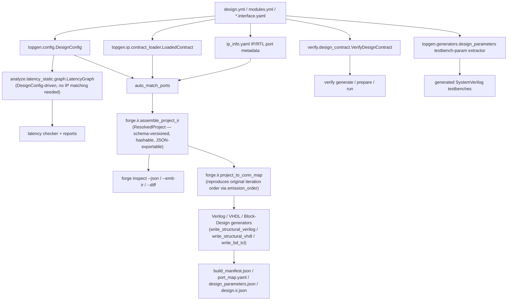

# FORGE

Framework for Orchestrated RTL Generation & Evaluation.

> An algorithm-agnostic, contract-driven integration and verification
> framework for RTL and HLS firmware targeting **AMD/Xilinx** FPGA
> toolchains.

FORGE is a plugin-agnostic framework for contract-driven DUT generation,
optional HLS orchestration, and reusable verification runtime flows.
It originated as trigger/DAQ firmware tooling built at CERN for the
CMS/OMTF collaboration, and is released as a general-purpose,
detector-agnostic open-source project (MIT-licensed) — CMS/OMTF remains
a user of the framework, not its scope. See `CONTRIBUTING.md` for the
provenance note and current distribution story (git-install-only, no
PyPI publish — a closed decision, not a placeholder pending one).

Repository target:

- Migrating to a public host (`https://github.com/<org>/forge` —
  placeholder until finalized). Until then, the CERN GitLab origin
  (`https://gitlab.cern.ch/pleguina/arc-framework`) remains authoritative.

## Current scope

FORGE's public identity for this release is deliberately narrower than
"universal FPGA/ASIC framework." What's actually implemented and tested:

| Axis | Current support |
|---|---|
| Toolchains | Vivado (structural Verilog/VHDL, Block Design TCL), Vitis HLS, XSim |
| Simulation backends | `xsim`, `csim`; Verilator is available as a lint tool only, not a simulation backend |
| Verification datasets | XML-backed only (`design.verification.yml` + XML golden data) |
| Clock/reset domains | A single functional clock/reset domain per module — `clock_secondary`/`reset_secondary` roles exist in the schema but are explicitly **reserved** and have no functional effect (see `docs/IP_INTERFACE_POLICY.md` "Reserved roles"). Real, structural cross-module CDC crossing detection and synchronizer generation *do* exist (`forge.topgen.ip.cdc.verify_cdc`), gated behind `gen-top --strict` |
| Topology matching | Contract-driven wiring, scatter/gather, N-D template and prefix-array bindings, structured `coordinates:`/legacy `partition:` matching (see `docs/IP_INTERFACE_POLICY.md`) |
| Vendors/toolchains **not** supported | Intel/Altera, Lattice, generic ASIC flows, GHDL or cocotb/VUnit as a primary simulation path |

`docs/development/release-readiness.md` tracks the full public-release
checklist (canonical design IR, generation-plan hashing, provenance,
visual design explorer, MkDocs site, additional backends, and more) with
per-item status and evidence — treat that file, not marketing copy, as the
source of truth for what's DONE versus planned.

## Architecture (canonical IR — generation is IR-driven for all three modes)

A canonical resolved-design IR now exists (`forge/ir/` — `ResolvedProject`/
`ResolvedDesign`/etc., see `forge inspect` below) covering topology/config
loading, interface-contract loading, and IP/RTL port metadata. As of
migration step 5, `topgen gen-top` — `--mode verilog`, `vhdl`, and `bd`
alike — is genuinely **driven by** the IR: it builds the IR from its
matching/config computation, then each generator
(`write_structural_verilog`/`write_structural_vhdl`/`write_bd_tcl`) is fed
the connection topology projected back out of the IR
(`forge.ir.project.project_to_conn_map`) rather than the raw matcher output
directly — proven byte-identical to the original on both reference designs
before each switch (see `docs/development/release-readiness.md`, Phase 1
slices 4–5). `design.ir.json` is emitted from that same IR object alongside
the existing manifests for verilog/vhdl/bd, and now also carries the
resolved top-level port list (`design.top_ports`) for verilog mode —
migration step 6 replaced `generate_port_map`'s regex re-parse of the just-
generated Verilog file with the generator's own structured
`report["top_ports"]` (proven byte-identical to the re-parse first; see
Phase 1 slice 6). `forge analyze latency-check`'s `LatencyGraph` (migration
step 7) also no longer independently re-parses `design.yml`/`modules.yml` —
it now builds from `DesignConfig`/`Module` (the same shared loader the IR
itself uses), including the module registry's optional
`latency_cycles`/`latency_hint`/`variable_latency` metadata
(`Module.timing`, see `docs/IP_INTERFACE_POLICY.md`), while deliberately
stopping short of the full matched IR so latency analysis keeps working
before any IP is built (see Phase 1 slice 7). It is **not yet** consumed
by `generate_build_manifest` (needs resolved build-artifact paths the IR
doesn't model yet), visualization, or verification planning — those still
independently re-derive overlapping facts from the same
`design.yml`/`modules.yml`/interface-contract YAML sources, exactly as
shown below. Migrating them onto the IR is tracked incrementally in
`docs/development/release-readiness.md` — this diagram will keep being
updated as each subsystem migrates, not rewritten in one step once
everything is done.



Try it:

```bash
forge inspect plugins/passthrough_demo/forge/designs/design.yml \
    --contracts-from plugins/passthrough_demo/forge/modules.yml

# JSON, a written IR snapshot, and content-hash provenance:
forge inspect design.yml --contracts-from modules.yml --json
forge inspect design.yml --contracts-from modules.yml --emit-ir build/forge/design.ir.json
forge inspect design.yml --contracts-from modules.yml --provenance build/forge/provenance.json
forge inspect design.yml --contracts-from modules.yml --explain-staleness build/forge/provenance.json
```

Each `ResolvedConnection` in the IR carries a `wiring_method`
(`contract_wiring`/`topology_group`/`port_map`/`auto_match`/`heuristic`) —
the first slice of matching evidence (release-plan §3.5).

## Versioning

Two independent version numbers appear in this repo — they track different
things and are not expected to match:

- **Package version** (`forge/pyproject.toml`, currently `2.0.0`) — the
  installed `forge` Python package/CLI release. Follows semver; see
  `CONTRIBUTING.md` for what counts as a MAJOR/MINOR/PATCH change here.
  `2.0.0` is the ARC → FORGE rename — a breaking, shim-free change to the
  CLI/package/directory surface. See `MIGRATION.md`.
- **Verification contract version** (currently `v1.0`, referenced throughout
  `docs/`) — the version of the Layer 1 verification model itself
  (`design.verification.yml` schema, generated artifact set, CLI contract
  behavior). It changes far less often than the package version, and did
  not change in `2.0.0`.

## Documentation Index

This index lists the minimum user-facing documentation required to adopt and use FORGE.

### Introduction

- `forge/README.md` - CLI command reference and generated output summary

### Quickstart

- `docs/MINIMAL_CONSUMER_QUICKSTART.md` - shortest supported adoption path

### Authoring and Contracts

- `docs/PLUGIN_AUTHOR_GUIDE.md` - plugin contract authoring and topology wiring
- `docs/IP_INTERFACE_POLICY.md` - interface contract policy and constraints
- `normalized_signal_families.yaml` - canonical signal family vocabulary

### Runtime and Verification

- `docs/FRAMEWORK_CORE_INTERFACE.md` - Layer 1 runtime and verification interface
- `docs/VERIFY_PLUGIN_AUTHOR_GUIDE.md` - verification integration for plugin authors
- `docs/VERIFY_FRAMEWORK_SETUP.md` - framework-side setup and runnable proof path

### Tooling

- `docs/FRAMEWORK_TOOLING_INTERFACE.md` - Layer 2 topology/HLS tooling interface
- `forge/README.md` - forge CLI command usage and outputs

### Support Boundaries

- `docs/SUPPORT_CLASSIFICATION.md` - supported versus internal surfaces

### Validation Gate

- `run_trigger_demo.sh` - end-to-end release gate (`ci/framework-release.yml`)
- `ci/agnosticism_check.sh` - guard against hardcoded algorithm assumptions

### Project

- `docs/development/release-readiness.md` - public-release checklist with per-item status and evidence
- `CHANGELOG.md` - notable changes by release
- `CONTRIBUTING.md` - development setup and contribution workflow
- `MIGRATION.md` - breaking-change notes (start here if upgrading from ARC)
- `SECURITY.md` - how to report a security issue
- `CODE_OF_CONDUCT.md` - community expectations for contributors
- `LICENSE` - MIT
