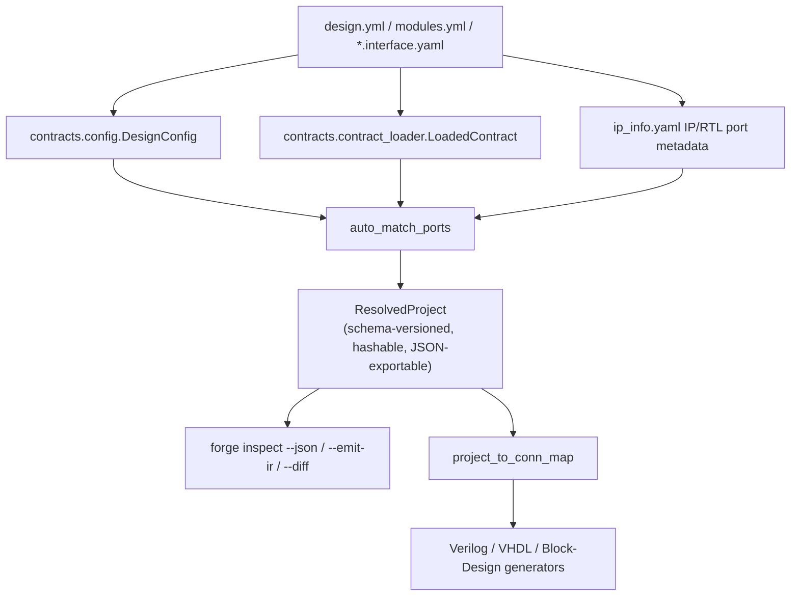

# Architecture Rationale

This page explains *why* FORGE is structured the way it is. For what a
given schema or interface actually contains, see the [concepts](../concepts/core-interface.md)
and [reference](../reference/artifacts.md) sections; this page is about the
design decisions behind them.

## Contract-first wiring, heuristics as legacy fallback only

FORGE's central architectural bet is that **topology wiring should be
declared, not guessed**. Every module can carry an interface contract
(`*.interface.yaml`) declaring its ports as typed roles — `clock_primary`,
a scalar data role, an array role with a `wiring_kind` label, and so on.
When two modules' contracts declare matching roles, FORGE wires them
directly and authoritatively (`wiring_method: contract_wiring` on the
resulting `ResolvedConnection`) — no name-matching heuristics are
consulted for a contract-supported connection.

Heuristic port-name matching (`auto_match`/`heuristic` wiring methods)
still exists, but as a **compatibility fallback**, for modules that don't
yet have a contract — not as the primary mechanism. This ordering matters
for a specific, real reason: heuristic matching that happens to work
today can silently start wiring the wrong ports tomorrow, once port names
drift, with no contract to catch it. A contract makes wiring intent
explicit and checkable — `forge topgen gen-top --strict` can (and does)
fail loudly when a connection falls back to auto-match or a topology
group has verification errors, exactly because heuristic wiring is
something FORGE wants surfaced, not silently accepted. Every
`ResolvedConnection` in the canonical IR carries this `wiring_method` as
real matching evidence, and the [visual explorer](../concepts/visual-explorer.md)
renders it directly (color-coded per method) and rolls it up into a
per-module maturity signal (`CONTRACT`/`MIXED`/`COMPATIBILITY`) — so
"how much of this design is still relying on heuristics" is a visible,
answerable question, not something you have to infer from generated RTL.

## The canonical IR as the single source of truth for generation

Earlier in FORGE's history, topology generation, the canonical IR
snapshot, and latency analysis each independently re-derived overlapping
facts from the same `design.yml`/`modules.yml`/interface-contract YAML —
three parsers of the same intent, with no guarantee they agreed. FORGE's
current architecture instead resolves a design once into a canonical,
schema-versioned IR (`forge.ir.model.ResolvedProject`), and drives
generation *from* that IR rather than from the raw matcher output
directly:

This isn't just tidiness. Once `write_structural_verilog`/
`write_structural_vhdl`/`write_bd_tcl` all consume the same projected IR
connection topology, "does this design mean the same thing in every
output mode" stops being a question you answer by re-reading three
generators and becomes a question the IR itself already answers once.
It's also what makes [content-hash provenance](../concepts/datasets-and-provenance.md)
meaningful: hashing the IR's content is only a useful reproducibility
signal because the IR is genuinely what generation is driven from, not a
side artifact computed after the fact. See root `README.md`'s
"Architecture" section for the specific migration history behind this
(which subsystems consume the IR today, which still independently
re-derive facts and are tracked to migrate later) — this page explains
why the direction was chosen, not the current migration status itself.

## Why a plugin capsule (`forge/` subdirectory) exists

A FORGE plugin (`plugins/<name>/`) separates its **implementation
sources** (algorithm C++/HDL under `algo/`) from its **FORGE integration
contract** (module registry, interface contracts, verification contract,
all under a single `forge/` subdirectory) rather than interleaving them.
This split exists for a specific reason: the `forge/` capsule is the only
part of a plugin FORGE itself needs to understand, and keeping it
physically separate means a plugin's algorithm code can be organized
however its own domain conventions demand, without FORGE's tooling ever
needing to know or care about that structure. It also makes the boundary
between "what FORGE core owns" and "what a plugin owns" a directory
structure fact, not a matter of convention scattered across files — the
same discipline `ci/agnosticism_check.sh` enforces from the other
direction (see [extension APIs](extension-apis.md)): `forge/` core has no
business reaching into a plugin's `algo/` layout, and a plugin has no
business needing to modify anything under FORGE's own `forge/` package.
