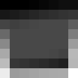
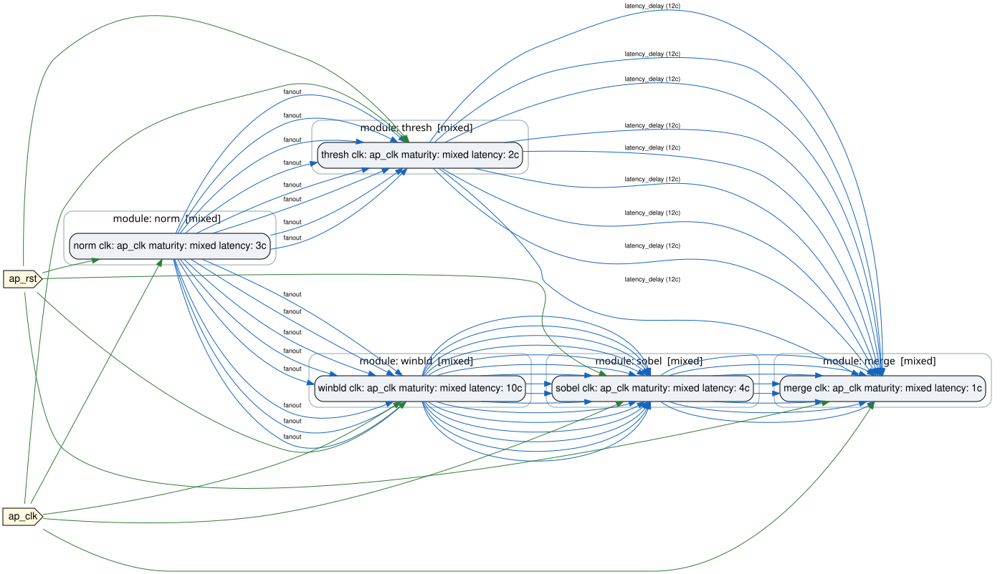

# 03 — Mixed RTL/HLS

<nav class="forge-step-strip" aria-label="Chapter progress" markdown="span">
[01](01-quickstart.md) [02](02-project-structure-and-contracts.md) **03** [04](04-parallel-paths-and-latency.md) [05](05-bounded-and-elastic-processing.md) [06](06-clock-domains-and-cdc.md) [07](07-throughput-backpressure-and-fifos.md) [08](08-datasets-and-golden-models.md) [09](09-full-functional-design.md) [10](10-platform-integration.md) [11](11-inspect-report-and-reproduce.md) [12](12-diagnostics-and-negative-fixtures.md)
</nav>

*Step 3 of 12*

**Step in this chapter:** `pixel_result` · **Tools needed:** Python, Vitis HLS, Vivado XSim

## Goal

Add a second HLS module and a real fan-out from one producer to two
independent downstream consumers.

## What you will learn

- How one module's output can drive two different downstream paths.
- How a second HLS module (`sobel_hls`) joins the registry alongside `pixel_normalizer`.
- What a real RTL sliding-window module (`window_builder_rtl`) looks like.

## Starting design

`design.yml` (chapter 01): `pixel_normalizer` → `threshold_rtl`.

## What you add

```
external pixel stream -> pixel_normalizer (HLS)
  -> window_builder_rtl (RTL) -> sobel_hls (HLS)  ─┐
  -> threshold_rtl (RTL), +12-cycle alignment delay ┴-> edge_mask_merge_rtl (RTL)
  -> external edge_mask_stream
```

`pixel_normalizer`'s single output now fans out to two independent
consumers: `window_builder_rtl` (which builds the 3×3 window
`sobel_hls` needs) and `threshold_rtl` (the same module from chapter
01, unchanged). One clock domain still — no CDC until chapter 06.

## Files you edit

| File | Ownership |
|---|---|
| `plugins/vision_pipeline_demo/algo/sobel/sobel_hls.cpp` | <span class="badge badge-source">PROJECT SOURCE</span> |
| `plugins/vision_pipeline_demo/algo/rtl/window_builder_rtl.v` | <span class="badge badge-source">PROJECT SOURCE</span> |
| `plugins/vision_pipeline_demo/algo/rtl/edge_mask_merge_rtl.v` | <span class="badge badge-source">PROJECT SOURCE</span> |
| `plugins/vision_pipeline_demo/forge/designs/design_pixel_result.yml` | <span class="badge badge-source">PROJECT SOURCE</span> |

## What FORGE generates

| Artifact | Ownership |
|---|---|
| `gen-top/design_vision_pipeline_pixel_result/algo_top.v` | <span class="badge badge-generated">FORGE GENERATED</span> |
| `plugins/vision_pipeline_demo/forge/verify/pixel_result_xsim/` | <span class="badge badge-generated">FORGE GENERATED</span> + <span class="badge badge-toolchain">TOOLCHAIN OUTPUT</span> |

## Command to run

```bash
./run_vision_pipeline_demo.sh --step pixel_result
```

Or manually, once `sobel_hls` is synthesized (`forge hls run --stages
synth --modules pixel_normalizer,sobel_hls ...`, same shape as chapter
01's HLS build):

```bash
forge topgen validate plugins/vision_pipeline_demo/forge/designs/design_pixel_result.yml

forge topgen gen-top plugins/vision_pipeline_demo/forge/designs/design_pixel_result.yml \
  --mode verilog --consumer-root . \
  --contracts-from plugins/vision_pipeline_demo/forge/modules.yml \
  --hls-build-root build_hls_vision_pipeline_demo \
  --output gen-top/design_vision_pipeline_pixel_result/algo_top.v

forge verify generate plugins/vision_pipeline_demo/forge/verify/design.verification.yml --flow pixel_result_xsim
python3 plugins/vision_pipeline_demo/forge/verify/tools/gen_stimulus_pixel_result.py --flow pixel_result_xsim
forge verify run plugins/vision_pipeline_demo/forge/verify/pixel_result_xsim/verify.flow.yml \
  --plugin vision_pipeline_demo --consumer-root .
```

## Expected terminal result

```
Scoreboard check: PASS
```

Streams the full 8×8 frame (64 pixels) through in one run — every
`forge.pixel_stream.v1` field, plus the new `gradient_magnitude` field
`sobel_hls` computes, checked against the golden model.

## Artifacts to inspect

- `gen-top/design_vision_pipeline_pixel_result/algo_top.v` — now has two
  HLS module instances (`norm`, `sobel`) alongside two RTL instances
  (`winbld`, `thresh` — plus `merge`, covered next chapter).

## Visual result

<figure markdown>
  { width=180 }
  <figcaption>gradient_magnitude = clamp(abs(Gx) + abs(Gy), 0, 4095), rendered at real relative intensity.</figcaption>
</figure>

Compare against chapter 01's input/normalized panels
(`quickstart-input.png`/`quickstart-normalized.png`) — same dataset,
now with a second HLS module computing a genuinely new field alongside
the original one.

Topology, now with the fan-out and merge point chapter 04 examines:

<figure markdown>
  { width=650 }
  <figcaption>norm fans out to two independent branches, both converging at merge.</figcaption>
</figure>

## Why the capability matters

Fan-out (one producer, multiple independent consumers) is the shape
every richer design in this tutorial builds on — chapter 09's
full-functional design fans one normalizer out to *four* consumers using
exactly this same mechanism, just with more instances.

## Common failure

None specific to this chapter — see [chapter
12](12-diagnostics-and-negative-fixtures.md) for this plugin's real
negative fixtures.

## What changed from the previous chapter

A second HLS module (`sobel_hls`) and a real RTL sliding-window module
(`window_builder_rtl`) joined the registry; `pixel_normalizer`'s output
now drives two consumers instead of one.

## Next chapter

[04 — Parallel paths and latency](04-parallel-paths-and-latency.md)
