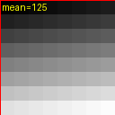
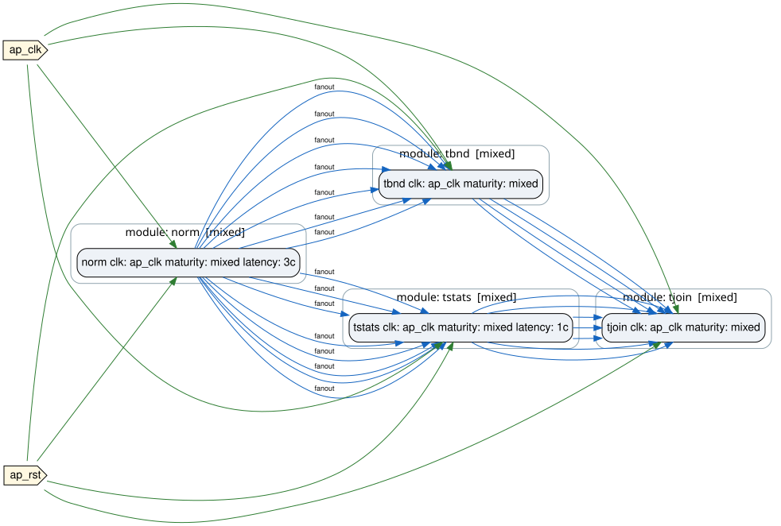

# 05 — Bounded and elastic processing

**Step in this chapter:** `tile_stats` · **Tools needed:** Python, Vitis HLS, Vivado XSim

## Goal

Add a third latency shape — bounded, not fixed — and see FORGE classify
a merge point as `bounded_skew` instead of `exact_cycle`.

## What you will learn

- What "bounded" latency means and why a hold window (`[min, max]`) is the right shape for it.
- What an elastic join is and why it can't declare a fixed cycle count of its own.
- Why this path is a completely separate design from chapter 03's, not a variant of it.

## Starting design

None of the previous chapters' designs — `design_tile_stats.yml` is its
own standalone design, reusing `pixel_normalizer` behind its own `norm`
instance (the same "one design, one instance" convention chapter 03's
design already established).

## What you add

```
external pixel stream -> pixel_normalizer (HLS)
  -> tile_stats_hls (HLS, fixed 1-cycle latency, real II=1)  ─┐
  -> tile_boundary_rtl (RTL, bounded hold)                    ┴-> tile_summary_join_rtl (RTL)
  -> external forge.tile_statistics.v1 record
```

`tile_stats_hls` and `tile_boundary_rtl` are both direct fan-out
siblings of `pixel_normalizer` — not chained after each other — so they
see the tile-last sample on the exact same input cycle.

## Files you edit

| File | Ownership |
|---|---|
| `plugins/vision_pipeline_demo/algo/tile_stats/tile_stats_hls.cpp` | **PROJECT SOURCE** |
| `plugins/vision_pipeline_demo/algo/rtl/tile_boundary_rtl.v` | **PROJECT SOURCE** |
| `plugins/vision_pipeline_demo/algo/rtl/tile_summary_join_rtl.v` | **PROJECT SOURCE** |
| `plugins/vision_pipeline_demo/forge/designs/design_tile_stats.yml` | **PROJECT SOURCE** |

## What FORGE generates

| Artifact | Ownership |
|---|---|
| `gen-top/design_vision_pipeline_tile_stats/algo_top.v` | **FORGE GENERATED** |
| `plugins/vision_pipeline_demo/forge/verify/tile_stats_xsim/` | **FORGE GENERATED** + **TOOLCHAIN OUTPUT** |

## Command to run

```bash
./run_vision_pipeline_demo.sh --step tile_stats
```

## Expected terminal result

```
Scoreboard check: PASS
```

## Artifacts to inspect

```bash
forge analyze latency-check plugins/vision_pipeline_demo/forge/designs/design_tile_stats.yml \
  --contracts-from plugins/vision_pipeline_demo/forge/modules.yml \
  --hls-build-root build_hls_vision_pipeline_demo
```

`out/reports/latency_check.md` classifies `tile_summary_join_rtl`'s
merge point as `bounded_skew`, not `exact_cycle` — the real, meaningful
difference from chapter 04's merge point:

- `tile_boundary_rtl` declares `kind: bounded, min_cycles: 1,
  max_cycles: 17` in `modules.yml` — its tag latches 1 cycle after the
  triggering tile-last sample and stays valid for 16 cycles after that.
  A hold window, not a single number, because the tag's own validity
  genuinely spans a range of cycles.
- `tile_summary_join_rtl` declares `kind: elastic` — it *cannot* declare
  a fixed cycle count of its own, because its real completion time is
  dominated by whichever of its two predecessors (one fixed, one
  bounded) is slower for a given tile, not by its own 1-cycle
  match-and-forward step.

`forge topgen validate` checks that the two windows genuinely overlap;
`tile_summary_join_rtl`'s own `join_mismatch` output re-verifies the same
`tile_id`/`frame_id` agreement at runtime.

## Visual result

<figure markdown>
  { width=180 }
  <figcaption>Real tile boundary (red) and TileStatsProvider's own computed mean=125 for this frame's one tile.</figcaption>
</figure>

<figure markdown>
  { width=550 }
  <figcaption>norm fans out to the bounded (tbnd) and fixed (tstats) branches, joining at the elastic tjoin.</figcaption>
</figure>

## Why the capability matters

Bounded and elastic are the two latency shapes `fixed` (chapters 01–04)
can't express — a module whose completion time genuinely depends on
runtime conditions (a hold window, a race between two predecessors)
needs one of these, and FORGE's merge-point checker needs to know which
one to check it correctly.

## Common failure

A merge point whose two predecessors' windows don't actually overlap is
caught by `forge topgen validate`, the same way an `exact_cycle`
mismatch is in chapter 04 — see [chapter
12](12-diagnostics-and-negative-fixtures.md).

## What changed from the previous chapter

A new, independent design (not a variant of chapter 03's) introducing
`bounded` and `elastic` latency alongside `fixed`.

## Next chapter

[06 — Clock domains and CDC](06-clock-domains-and-cdc.md)
