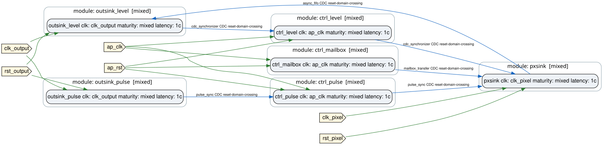

# 06 — Clock domains and CDC

**Step in this chapter:** `cdc` · **Tools needed:** Python, Vivado XSim *(no Vitis HLS — see below)*

## Goal

Cross three genuinely independent clock domains using all five FORGE
CDC primitives, and understand the one convention every crossing in this
plugin shares.

## What you will learn

- How a design declares more than one clock domain.
- What each of `level_sync`, `pulse_sync`, `mailbox_transfer`, `async_fifo`, and `reset_sync` actually crosses.
- Why a crossing's destination needs its own novelty-detection convention, and what this plugin's is.

## Starting design

None of the previous chapters — `design_cdc.yml` is a standalone design,
built entirely from RTL (no HLS module at all — this is the one chapter
in the tutorial that needs no Vitis HLS build).

## What you add

```
control (ap_clk, 50MHz)   --level_sync---->  pixel (clk_pixel, 200MHz)
  ctrl_level / ctrl_pulse /  --pulse_sync---->
  ctrl_mailbox                --mailbox_transfer->

pixel   (clk_pixel)         --async_fifo----->  output (clk_output, 125MHz)
  pixel_sink                                     outsink_level

output  (clk_output)        --level_sync---->  control
  outsink_level / outsink_pulse  --pulse_sync---->
```

Three domains, six connections, one of every CDC kind (`level_sync`/
`pulse_sync` appear twice, in both directions).

## Files you edit

| File | Ownership |
|---|---|
| `plugins/vision_pipeline_demo/algo/rtl/ctrl_level_rtl.v`, `ctrl_pulse_rtl.v`, `ctrl_mailbox_rtl.v` | **PROJECT SOURCE** |
| `plugins/vision_pipeline_demo/algo/rtl/pixel_sink_rtl.v` | **PROJECT SOURCE** |
| `plugins/vision_pipeline_demo/algo/rtl/outsink_level_rtl.v`, `outsink_pulse_rtl.v` | **PROJECT SOURCE** |
| `plugins/vision_pipeline_demo/forge/designs/design_cdc.yml` | **PROJECT SOURCE** |

## What FORGE generates

| Artifact | Ownership |
|---|---|
| `gen-top/design_vision_pipeline_cdc/algo_top.v` | **FORGE GENERATED** |
| `plugins/vision_pipeline_demo/forge/verify/cdc_xsim/` | **FORGE GENERATED** + **TOOLCHAIN OUTPUT** |

## Command to run

```bash
./run_vision_pipeline_demo.sh --step cdc
```

No `--skip-hls` flag needed: this step genuinely never invokes Vitis
HLS, because `design_cdc.yml` has zero HLS module instances — confirmed
by reading every `ref:` in the design file, not assumed from the
topology diagram.

## Expected terminal result

```
[xsim 3/3] Simulating
Scoreboard check: PASS
```

Real, measured: about 7 seconds end to end (validate, gen-top, generate,
stimulus, doctor, run) — no HLS build in the critical path.

`gen_stimulus_cdc.py` drives fixed constants directly rather than a
per-event dataset — a scalar control-plane test doesn't fit the
golden-model-provider mold the pixel-stream flows use. 6/6 checks pass:
`error_level_status`, `frame_done_count`, `enable_status`,
`apply_count`, `mailbox_status`, `result_status` — one value carried
correctly across a real clock-domain boundary for each of the five CDC
kinds.

## Artifacts to inspect

```bash
forge inspect plugins/vision_pipeline_demo/forge/designs/design_cdc.yml \
  --contracts-from plugins/vision_pipeline_demo/forge/modules.yml \
  --dot /tmp/design_cdc.dot
```

Each CDC edge in the DOT output is labeled with its real kind, e.g.
`async_fifo CDC reset-domain-crossing` — the `reset-domain-crossing`
suffix appears whenever the two instances are also in different reset
domains, not just different clock domains.

## Visual result

<figure markdown>
  { width=700 }
  <figcaption>Every node's own label includes its real clock domain (clk: ap_clk/clk_pixel/clk_output) — the closest thing to a domain-grouped view this renderer produces today; a dedicated color-grouped-by-domain figure is a reasonable future FORGE-core rendering enhancement, not yet built.</figcaption>
</figure>

## Why the capability matters

FORGE's structural port wiring has no generic valid/ready or
empty/full concept at a crossing boundary — every module that consumes
one needs its own convention for detecting when the crossed signal
actually carries something new. This plugin's convention (a toggle bit
embedded in the payload itself, changing value exactly once per real
dequeued/latched value) is the same one chapter 07's packetizer relies
on for its own `async_fifo` crossings — see
`docs/development/adr/0002-cdc-primitive-semantics.md` for the full
rationale.

A new clock domain is introduced simply by having one module instance
somewhere declare a `clock_primary` `raw_port` name that isn't already
in use elsewhere in the design — there's no separate "clock domain"
field independent of that (see chapter 02's contract discussion).

## Common failure

An undeclared, direct wire crossing two clock domains — no `cdc:` block
at all — is exactly what this plugin's `invalid_direct_bus_cdc.yml`
negative fixture demonstrates being rejected. See [chapter
12](12-diagnostics-and-negative-fixtures.md).

## What changed from the previous chapter

A completely new topology shape: three real clock domains instead of
one, zero HLS modules, and all five CDC primitives exercised together.

## Next chapter

[07 — Throughput, backpressure, and FIFOs](07-throughput-backpressure-and-fifos.md)
