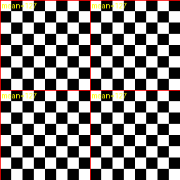
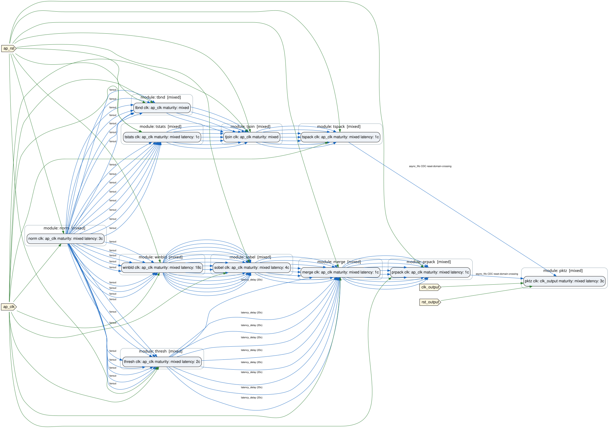

# 09 — Full-functional design

<nav class="forge-step-strip" aria-label="Chapter progress" markdown="span">
[01](01-quickstart.md) [02](02-project-structure-and-contracts.md) [03](03-mixed-rtl-hls.md) [04](04-parallel-paths-and-latency.md) [05](05-bounded-and-elastic-processing.md) [06](06-clock-domains-and-cdc.md) [07](07-throughput-backpressure-and-fifos.md) [08](08-datasets-and-golden-models.md) **09** [10](10-platform-integration.md) [11](11-inspect-report-and-reproduce.md) [12](12-diagnostics-and-negative-fixtures.md)
</nav>

*Step 9 of 12*

**Step in this chapter:** `full_functional` · **Tools needed:** Python, Vitis HLS, Vivado XSim

## Goal

Unify every path built so far behind one shared normalizer, at a real
16×16 frame scale instead of 8×8.

## What you will learn

- How one producer fans out to four downstream consumers instead of two.
- Why a larger frame forces a real 2×2 tile grid, not just more pixels.
- How to read a real conservation check across hundreds of records.

## Starting design

Reuses every module chapters 03, 05, and 07 already built — the
difference is topology, not new modules.

## What you add

```
                         ┌─> winbld -> sobel  ─┐
external pixel stream -> norm (pixel_normalizer, HLS)
                         ├─> thresh, +20-cycle delay ┴-> merge -> prpack ─┐
                         │                                                │ [async FIFO: pixel -> output, depth 128]
                         └─> tstats -> tjoin  ─┐                          ┴-> pktz (output domain) -> external forge.packet_stream.v1
                             tbnd    ──────────┴-> tspack ────────────────┘ [async FIFO: pixel -> output, depth 64]
```

ONE normalizer instance now fans out to all four downstream consumers —
unlike chapter 07's deliberate two-instance (`norm_px`/`norm_tile`)
scope choice, this design is the unified, full-scale assembly.

## Files you edit

| File | Ownership |
|---|---|
| `plugins/vision_pipeline_demo/forge/designs/design_full_functional.yml` | <span class="badge badge-source">PROJECT SOURCE</span> |

No new RTL/HLS modules — every module here already exists from earlier
chapters. `winbld`'s `FRAME_WIDTH` is overridden to 16 via a
design-level `parameters:` block (a real per-instance Verilog `#(...)`
mechanism), with a correspondingly recomputed `latency:` override (18
cycles instead of 10).

## What FORGE generates

| Artifact | Ownership |
|---|---|
| `gen-top/design_vision_pipeline_full_functional/algo_top.v` | <span class="badge badge-generated">FORGE GENERATED</span> |
| `plugins/vision_pipeline_demo/forge/verify/full_functional_xsim/` | <span class="badge badge-generated">FORGE GENERATED</span> + <span class="badge badge-toolchain">TOOLCHAIN OUTPUT</span> |
| `plugins/vision_pipeline_demo/forge/verify/full_functional_xsim/throughput_result.json` | <span class="badge badge-verification">VERIFICATION RESULT</span> |

## Command to run

```bash
./run_vision_pipeline_demo.sh --step full_functional
```

## Expected terminal result

```
Scoreboard check: PASS
```

256 pixel-result records + 4 tile-statistics records = **260/260
checks pass**, every field, content-matched from whichever beat/slot
each record actually landed in.

## Artifacts to inspect

`throughput_result.json` (real, measured):

| Crossing | Accepted | Emitted | High-water mark |
|---|---|---|---|
| pixel-result async FIFO (depth 128) | 256 | 256 | 100 |
| tile-statistics async FIFO (depth 64) | 4 | 4 | 1 |

Zero dropped, zero duplicated, zero full events on either FIFO — real
conservation confirmed at a scale 4× chapter 07's own 8×8 test.

```bash
forge analyze latency-check plugins/vision_pipeline_demo/forge/designs/design_full_functional.yml \
  --contracts-from plugins/vision_pipeline_demo/forge/modules.yml \
  --hls-build-root build_hls_vision_pipeline_demo
```

confirms zero merge-point mismatches at the new frame scale.

## Visual result

<figure markdown>
  { width=260 }
  <figcaption>Real 2x2 tile grid (tile_id 0, 1, 1024, 1025 — the (tile_row*1024 + tile_col) formula, not a plain row-major index), each labeled with its own real computed mean.</figcaption>
</figure>

<figure markdown>
  { width=750 }
  <figcaption>norm fans out to winbld/sobel, thresh, and tstats/tbnd — the unified assembly chapters 03/05/07 each built a piece of.</figcaption>
</figure>

See [chapter 07](07-throughput-backpressure-and-fifos.md)'s FIFO
high-water figure for this design's own bars (100 and 1) alongside the
8x8-scale numbers.

## Why the capability matters

A FIFO depth sized correctly for one dataset scale isn't automatically
safe at a larger one if there's a genuine sustained write-rate-exceeds-
read-rate mismatch. `design_packetizer.yml` (chapter 07) used depth 64
for both crossings at an 8×8, 64-pixel scale; at this design's real
256-pixel, sustained-burst scale, the pixel-result crossing's real
high-water mark (measured, not estimated) is 100 — it was raised to
depth 128 for exactly that reason, confirmed by a real xsim run rather
than assumed from the formula. Always re-measure a FIFO's real
high-water mark at a new dataset scale rather than assuming a
previously-safe depth still holds.

## Common failure

None specific to this chapter — see [chapter
12](12-diagnostics-and-negative-fixtures.md) for this plugin's real
negative fixtures.

## What changed from the previous chapter

Every path chapters 03–07 built independently is now one design, sharing
one normalizer instance, at 4× the frame scale.

## Next chapter

[10 — Platform integration](10-platform-integration.md)
