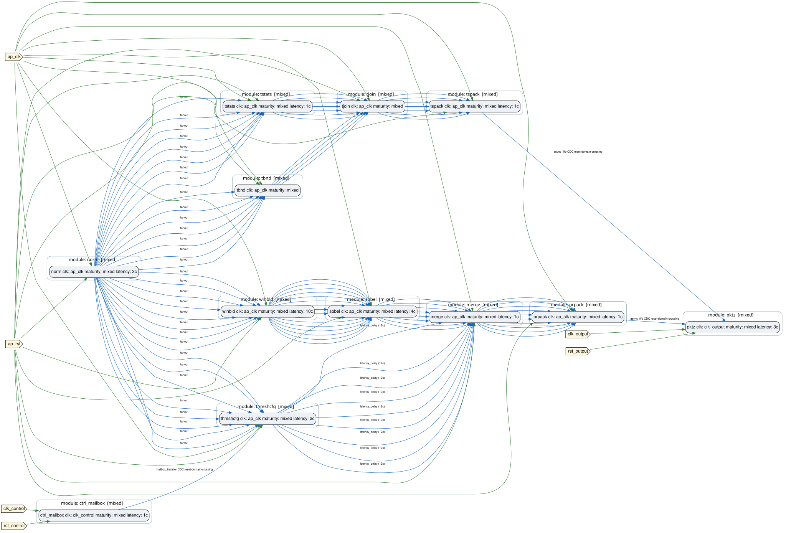

# The Vision Pipeline Tutorial

<div class="forge-hero" markdown>

<p class="forge-hero-tagline">Learn FORGE by building one real mixed HLS/RTL vision pipeline, from two modules and one clock to a full three-domain platform.</p>

You start with two module instances and one clock, and finish with a
real three-domain platform — control, pixel, and output clocks, all
five clock-domain-crossing kinds, a runtime-configurable threshold, and
an output packetizer with real backpressure telemetry.

Every design and command in this tutorial is real and CI-exercised
today (`.gitlab-ci.yml`'s `forge:vision-pipeline-release-gate` job runs
the exact same designs and flows). Nothing here is a preview of unbuilt
work. 12 chapters, 27 distinct FORGE capabilities, 8 real designs.

<span class="forge-hero-actions">
[Run the quickstart →](01-quickstart.md){ .md-button .md-button--primary }
[See the full chapter list ↓](#capability-map){ .md-button }
</span>

</div>

## What you will build

```
Chapter 01                              Chapter 10 (final platform)
────────────                            ──────────────────────────
pixel_normalizer (HLS)                  control (50MHz)
      │                                       │ mailbox_transfer
      ▼                                       ▼
threshold_rtl (RTL)                     pixel (200MHz)
      │                                 norm ─┬─ winbld → sobel ─┐
      ▼                                       ├─ threshcfg ──────┴→ merge → prpack ─┐
external result stream                        └─ tstats → tjoin ← tbnd → tspack ─┐  │
                                                                                  │  │ [async FIFO ×2]
                                                                                  ▼  ▼
                                                                    output (125MHz) → pktz
                                                                          │
                                                                          ▼
                                                         forge.packet_stream.v1 (256-bit beat)
```

Every intermediate stage between these two is its own real, runnable
design — see the chapter list below.

<figure markdown>
  { width=800 }
  <figcaption>The real, rendered topology of chapter 10's final platform — not a mockup.</figcaption>
</figure>

## Ownership legend

Every file and command output in this tutorial belongs to exactly one
of five categories. This label appears again on every chapter page next
to the files it introduces.

| Label | Meaning |
|---|---|
| <span class="badge badge-source">PROJECT SOURCE</span> | Files you own and edit: RTL, HLS, `modules.yml`, `design.yml`, interface contracts, datasets, golden models. |
| <span class="badge badge-generated">FORGE GENERATED</span> | Written by FORGE from your source: generated top-level RTL, verify-flow YAML/testbenches, stimulus, DOT/SVG/explorer, provenance. |
| <span class="badge badge-toolchain">TOOLCHAIN OUTPUT</span> | Written by Vitis HLS, Vivado, or XSim: synthesis reports, generated HLS RTL, simulation work libraries. |
| <span class="badge badge-verification">VERIFICATION RESULT</span> | Produced by running the design and comparing behavior: golden-comparison records, throughput results, CDC verification results. |
| <span class="badge badge-tutorial">TUTORIAL ASSET</span> | Small fixtures and metadata that exist only to teach the workflow: `README.md`, `tutorial.yml`. |

This vocabulary is enforced in code, not just prose — see
`plugins/vision_pipeline_demo/tutorial/ownership.py`, which classifies
every real file in the plugin and is tested against the actual tracked
file list.

```
plugins/vision_pipeline_demo/
├── algo/                                            [PROJECT SOURCE]
├── datasets/                                        [PROJECT SOURCE]
├── forge/modules.yml                                [PROJECT SOURCE]
├── forge/designs/                                   [PROJECT SOURCE]
├── forge/interfaces/                                [PROJECT SOURCE]
├── forge/verify/design.verification.yml             [PROJECT SOURCE]
├── forge/verify/{include,src,tests,tools,schemas}/   [PROJECT SOURCE]
├── tutorial.yml                                      [TUTORIAL ASSET]
├── tutorial/                                         [TUTORIAL ASSET]
└── README.md                                         [TUTORIAL ASSET]
```

Generated output lands in three real places, not one unified build
root — this tutorial always tells you which:

```
gen-top/design_vision_pipeline_<design>/algo_top.v      [FORGE GENERATED]
build_hls_vision_pipeline_demo/<module>/solution1/       [TOOLCHAIN OUTPUT]
plugins/vision_pipeline_demo/forge/verify/<flow>/
  verify.flow.yml, tb_algo_top.sv, stimulus_current.svh  [FORGE GENERATED]
  xsim_work/                                             [TOOLCHAIN OUTPUT]
  throughput_result.json                                 [VERIFICATION RESULT]
```

## Prerequisites by tier

| Tier | Needs | Chapters |
|---|---|---|
| Python only | `pip install -e forge/` | 02, 08, 12 (reading/diagnosing) |
| + Vivado XSim | `xsim` on `PATH` | 06 (the CDC chapter needs no HLS module at all) |
| + Vitis HLS | `vitis_hls` on `PATH` | 01, 03, 04, 05, 07, 09, 10, 11 |
| Optional | hls4ml | Not covered by this tutorial — see [Project scope](../../explanation/project-scope.md) |

## Capability map

| Chapter | Design | Capabilities introduced |
|---|---|---|
| [01 — Quickstart](01-quickstart.md) | `design.yml` | module registry, contracts, validation, RTL generation, HLS execution, golden-model verification |
| [02 — Project structure and contracts](02-project-structure-and-contracts.md) | *(quickstart, revisited)* | ownership vocabulary, interface contracts, module registry internals |
| [03 — Mixed RTL/HLS](03-mixed-rtl-hls.md) | `design_pixel_result.yml` | a second HLS module, fan-out from one producer |
| [04 — Parallel paths and latency](04-parallel-paths-and-latency.md) | `design_pixel_result.yml` | alignment delay, exact-cycle merge |
| [05 — Bounded and elastic processing](05-bounded-and-elastic-processing.md) | `design_tile_stats.yml` | bounded latency, elastic tagged join |
| [06 — Clock domains and CDC](06-clock-domains-and-cdc.md) | `design_cdc.yml` | 3 clock domains, all 5 CDC kinds |
| [07 — Throughput, backpressure, and FIFOs](07-throughput-backpressure-and-fifos.md) | `design_packetizer.yml` | async FIFO, static/runtime throughput, occupancy, backpressure |
| [08 — Datasets and golden models](08-datasets-and-golden-models.md) | *(all of the above, revisited)* | dataset adapters, golden-model provider boundary |
| [09 — Full-functional design](09-full-functional-design.md) | `design_full_functional.yml` | single shared normalizer fan-out, real dataset scale |
| [10 — Platform integration](10-platform-integration.md) | `design_platform_wrapper.yml` | 3-domain platform, runtime-configurable threshold |
| [11 — Inspect, report, and reproduce](11-inspect-report-and-reproduce.md) | `design_full_functional.yml` / `design_platform_wrapper.yml` | plan hash, provenance, DOT/SVG/explorer, offline report bundle |
| [12 — Diagnostics and negative fixtures](12-diagnostics-and-negative-fixtures.md) | both negative fixtures | validation diagnostics, expected-failure fixtures |

## Run only the quickstart

```bash
pip install -e forge/
./run_vision_pipeline_demo.sh --step quickstart
```

Real, tested: one HLS module, one RTL module, two verification flows, in
about 7 seconds once Vitis HLS has built `pixel_normalizer` once.

## Run everything

```bash
./run_vision_pipeline_demo.sh
```

Every real design and flow this plugin has — 8 designs, 9 flows, both
negative fixtures checked for their *expected* failure — in one command.
`./run_vision_pipeline_demo.sh --list` shows every step; `--step <id>`
runs just one.

## What's mandatory vs. optional

Everything in this tutorial (chapters 01–12) is the mandatory base and
is exercised by CI on every release. An optional hls4ml CNN extension is
tracked separately and is **not** covered here — see
[Project scope](../../explanation/project-scope.md) for its status.

## Next

Start with [01 — Quickstart](01-quickstart.md).
